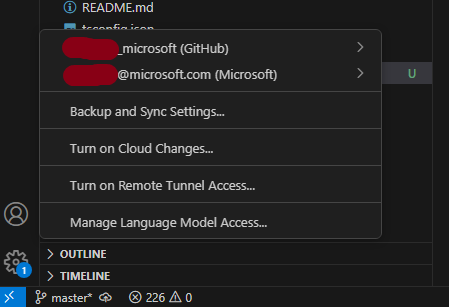

# GitHub Copilot at Microsoft - FAQ
## Quick Getting Started - VSCode with GitHub Copilot

**For Microsoft employees using VSCode, here's the fastest way to get started with GitHub Copilot:**

### 1. Ensure you're using the right identity
- **CRITICAL**: You must authenticate with your **`<alias>_microsoft`** EMU (Enterprise Managed User) account
- This account uses Microsoft's Identity provider and includes your EMU license
- Your username format is: `youralias_microsoft` (e.g., if your alias is jsmith, use `jsmith_microsoft`)
- This is NOT your email address - it's a special GitHub username
- This is NOT your personal github account that you may have linked to Microsoft previously

### 2. Quick authentication steps for VSCode
1. Open VSCode
2. Install the GitHub Copilot extension from the Extensions marketplace
3. Using the command palette, search for "GitHub Copilot: Sign In" and execute it OR use the GitHub icon in the Activity Bar on the bottom right and click `Sign In To Use Copilot`
4. Follow any authorization screens, ensure you use your `<alias>_microsoft` - which should redirect to the Microsoft login page (use corp credentials).
5. Verify Copilot is active - you should see the Copilot icon in your status bar
6. **Visual verification**: Your VSCode accounts should show your `<alias>_microsoft` EMU account. If you are using the Azure extension as well you will also see your @microsoft.com account reflected.

   

### 3. Important: If you're already logged into a personal GitHub account
If you previously authenticated VSCode with a personal GitHub account, you'll need to switch accounts:
1. In VSCode, open the Accounts menu (bottom-left corner)
2. Select your personal GitHub account and choose "Sign Out"
4. Restart VSCode
5. Follow the authentication steps above with your `<alias>_microsoft` account
6. You can verify the correct account is active by checking the Accounts icon in the Activity Bar

### 4. Verify your access
- Check your account at [https://aka.ms/copilot](https://aka.ms/copilot) to confirm your Enterprise license
- If you see rate limit messages, ensure you've selected a billing entity at [https://github.com/settings/copilot/features](https://github.com/settings/copilot/features)

### 5. Alternative AI Extensions (Optional)
If you're interested in using alternative AI coding extensions like Roo or Cline alongside or instead of GitHub Copilot, refer to the [AI tools guidance](index.md) for the complete list of approved tools. **Important**: Follow the specific **Requirements** links for each tool to ensure proper installation instructions and compliance with Microsoft security policies, including using the correct accounts and approved models.

### Need more details?
- For EMU account details, see [What's an Enterprise Managed User (EMU) GitHub account?](#whats-an-enterprise-managed-user-emu-github-account)
- For troubleshooting videos: [aka.ms/copilot/videos](https://aka.ms/copilot/videos)
- For complete guidelines: [GitHub Copilot Use Guidelines](github-copilot-guidelines.md)

<!--
NOTE: this page was relocated from the "open source docs" repo to the 1ES AI eng hub repo to consolidate and simplify, since
GitHub Copilot is a general developer tool and not open source-specific. The previous commit history can be reviewed at
https://github.com/opensource-microsoft/docs/commits/main/docs/legal/cela-guidance/copilot-faq.md
-->

## Videos

Visit [aka.ms/copilot/videos](https://aka.ms/copilot/videos) for short-form
content, interviews and learning from senior engineers at the company.

## Features

<!--
This file is dynamically pulled into the FAQ and support tab shown at https://aka.ms/copilot
whenever the Open Source Management Portal internal site builds. No need to update the
content anywhere else.
-->

- SKU: GitHub Copilot Enterprise
- GitHub Copilot Chat: Enabled
- [GitHub Copilot Code Reviews](https://docs.github.com/en/enterprise-cloud@latest/copilot/using-github-copilot/code-review/using-copilot-code-review):
  Enabled, shipped December 2024
- [GitHub Copilot in the CLI](https://docs.github.com/en/copilot/github-copilot-in-the-cli/using-github-copilot-in-the-cli):
  Enabled
- GitHub Copilot Coding Agent: Enabled
- Other models such as Anthropic Claude and Google Gemini: available for
  Microsoft use
- [Premium Requests](https://docs.github.com/en/copilot/managing-copilot/understanding-and-managing-copilot-usage/understanding-and-managing-requests-in-copilot): Additional premium requests paid by 1ES
- Fine tuning custom models: Limited E+D early experimentation; feature
  development on pause as of January 2025.
- Code Referencing: Enabled
- Public Code Matching: Not blocking

## FAQ

### What rate limits apply to GitHub Copilot?

A premium request billing system launched in June 2025 and is enabled for Microsoft users who
use the GitHub Copilot Enterprise licenses provided by 1ES.

Microsoft users using 1ES-provided GitHub Copilot Enterprise are not capped and have unlimited
**premium requests** enabled.

Your editor/IDE will show you if premium requests are enabled.

If for some reason you see a message that premium requests are disabled, you may need to choose a
billing entity in your GitHub Copilot account settings at [https://github.com/settings/copilot/features](https://github.com/settings/copilot/features).
Accounts which have multiple billing entities available do not have a default selected. "Microsoft Copilot access"
and "MicrosoftOpenSource" all accrue billing to the same place.

With additional premium requests, your monthly allocation progress bar will move toward 100%.
Once you reach 100%, additional overages and use will be paid by Microsoft.

There is some rate limiting in place that you may experience:

- GitHub rate limits when capacity for specific models drops
- Abuse / significant high rate limits
- Exhausted premium requests, if you have not [configured a premium request billing entity](https://github.com/settings/copilot/features)

You can find details on the [GitHub Blog regarding Premium Model Requests](https://github.blog/news-insights/product-news/github-copilot-agent-mode-activated/#premium-model-requests).

Do not use the GitHub Copilot Free SKU, and make sure you have your enterprise license,
confirming at [aka.ms/copilot](https://aka.ms/copilot).

### Can I use Copilot with Azure DevOps?

Yes! Copilot is a developer productivity extension that runs on your computer.
Your project source code does not need to be located on GitHub.

### What is the seat use data being used for?

Seat use data and daily feature engagement activity is being used in aggregate to
inform dogfooding efforts and learn from internal use. Additionally, [Engineering
Thrive](https://aka.ms/engthrive) can use this to understand if there are any trends
in the technologies teams use and the impact of productivity with GitHub Copilot.

GitHub Copilot seat data and associated data may only be used for understanding dogfooding trends
and usage across the company. This data may not be used for evaluating an employee's performance
in any way. If you aren't sure if you can use data in a particular scenario, please work with
your CELA or HR team to understand if your proposed use case is permitted.

### Can I just use the GitHub Copilot Free product?

Not for Microsoft work. The Copilot Free product is designed for home use, and
we have the premium Copilot Enterprise SKU at no cost available to you.

GitHub Copilot Free does not include Microsoft's specific Copilot policies and
protections such as certain tented repository protections.

### What do I need to do to get GitHub Copilot Enterprise on my personal account?

If you are using your corporate GitHub EMU account, you already have access.

You may also have access if you are a member of Microsoft's largest open source
organizations: the Microsoft, Azure, and MicrosoftDocs organizations automatically
provide Copilot seats.

If you have a desire to use GitHub Copilot Enterprise from a personal machine
that is not managed by the corporation, you can use the portal at [https://aka.ms/copilot](https://aka.ms/copilot)
to link your personal account, invite the account to the MicrosoftCopilot organization,
then accept your invitation to that organization, using the interface on that portal.

### How can I remove my Copilot Enterprise account if I work in large Microsoft organizations?

If you work in the large Microsoft organizations on GitHub for official open source
work, such as the Microsoft, Azure, and MicrosoftDocs organization, a GitHub Copilot Enterprise
seat is provided automatically.

It is technically not possible to remove the license from your seat if you are a member
of these organizations.

If you wish to remove your GitHub Copilot Enterprise seat, but still work on official
projects, you will need to:

- Remove your work organization membership(s) from your personal GitHub account by
  navigating to [https://github.com/settings/organizations](https://github.com/settings/organizations)
  and using the "leave" buttons for any such organizations.
- Have your coworkers invite you to the specific GitHub repositories that you need
  to work in as an Outside Collaborator. You can learn more about Outside Collaborators
  at [https://aka.ms/github/outside-collaborators](https://aka.ms/github/outside-collaborators).
  Note that Outside Collaborators cannot be members of GitHub Teams or organizations.

Completing these steps will remove the GitHub Copilot seat from your account.

### Is there a cost to using GitHub Copilot?

There is no cost to you or your team. GitHub Copilot expenses are being
centrally covered by the Developer Division to facilitate dogfooding.

Please do not purchase your own subscription to Copilot Pro or use Copilot Free.
Expenses for GitHub products and services will not be approved to comply with
finance and procurement requirements.

### How can vendors get setup with an EMU account?

Vendors must join a security group and then will get EMU access and GitHub
Copilot access within a few hours. Please
[request to join the Core Identity Entitlement](https://aka.ms/copilot/vendors),
"GitHub Copilot for Vendors".

### Are there any regional restrictions for GitHub Copilot models?

Most models approved for use at Microsoft are broadly related.

However, due to an updated policy from Anthropic, GitHub can no longer provide Anthropic
models (Claude Sonnet, Claude Opus) to users in China. This change was implemented in
GitHub Copilot on Friday, Sep 19. For more information about Anthropic's
regional availability, please see [Anthropic's official guidance](https://www.anthropic.com/news/updating-restrictions-of-sales-to-unsupported-regions).

### What's an Enterprise Managed User (EMU) GitHub account?

Every Microsoft full-time employee has an implicit GitHub account that is in the
"Microsoft EMU" enterprise. This is a GitHub platform designed for internal
engineering use. It is not the same as your GitHub.com account. All GitHub
accounts have a unique _login_, which is a username, and does not appear like an
e-mail address. This is different from most corporate systems at Microsoft which
use an e-mail address format with your alias (or user principal name).

You may want to [sign out of GitHub](https://github.com/logout) first just to be
super sure you're signed into the right account.

You can get in to your EMU account either of these ways:

- Navigate to
  [https://github.com/enterprises/microsoft/sso](https://github.com/enterprises/microsoft/sso).
  You'll authenticate with AAD and then have an active session in the
  enterprise.
- Go to [https://github.com/login](https://github.com/login) and use a special
  username that has an underscore in it. Your username is your alias followed by
  `_microsoft`. You don't need a password, since it uses your corporate account.
  It is _not your corporate email address_.

Visual Studio Code and other extensions, if they open a web browser to
authenticate with Copilot for the first time, should use your active web browser
window.

To learn more about EMU, check out the
[GitHub inside Microsoft information and docs](https://aka.ms/gim/docs).

### Where can I find my current GitHub username or login?

You can visit [https://github.com/settings](https://github.com/settings). You
will clearly see your username next to your profile picture and name, in
parenthesis.

### How can I manage both an open source and an EMU GitHub account with Copilot?

It can be difficult. We'd appreciate your feedback as we all learn. We also know
that the product teams are thinking about ways to better support multiple GitHub
accounts to make this easier in the future.

For Visual Studio Code, it might make sense to use the standard editor for one
GitHub environment, and then use a Visual Studio Code Insiders installation for
the other.

If you choose to setup Copilot with both your EMU and your open source account,
it doesn't matter which one you use - you can use it with any codebase, even
from another environment.

### Can GitHub Copilot be used on a SAW?

This is a decision left to your silo administrators.

xME (AME, PME) and Torus identities do not have access to GitHub Copilot seats.

You will need to use your CORP identity alongside EMU, as EMU only supports
a single tenant.

### What tenants and enterprises provide Copilot Enterprise seats?

Several GitHub enterprise cloud accounts are used for different purposes at
Microsoft and within subsidiaries.

Microsoft CORP identities:

- [EMU](https://github.com/enterprises/microsoft) is associated with CORP and managed by 1ES
- [Proxima](https://aka.ms/gim/proxima) is associated with ESME and managed by 1ES
- [Microsoft Open Source](https://github.com/enterprises/microsoftopensource) and [MicrosoftCopilot](https://github.com/enterprises/microsoftcopilot)
  allow individual personal accounts to use 1ES-managed Copilot Enterprise, configured
  at [aka.ms/copilot](https://aka.ms/copilot).

xME, Torus, other production tenants: no GitHub enterprises are associated with
GitHub enterprises. AME, PME, Torus GitHub accounts are not provisioned or available.

Subsidiaries: LinkedIn and GitHub subsidiaries operate in their own IT environments.
For example, GitHub employees all have GitHub Copilot access already. Subsidiary
employees who also have Microsoft CORP credentials _may_ use the 1ES-provided
GitHub Copilot access; however, the subsidiary may have their own Copilot guidelines
and requirements.

Limited acquisitions and game studios: ABK (Activision-Blizzard-King) and other
game studios which do not provide Microsoft CORP tenant credentials may choose
to enable and purchase GitHub Copilot for their teams. However, any such
environments are not managed by 1ES.

### How can I disable GitHub Copilot?

Several choices exist:

- You can choose not to link your personal GitHub account and avoid joining a Microsoft GitHub organization which provides for
  automatic Copilot Enterprise licensing such as Microsoft, Azure (or, setup a unique account for company use)
- If you need to work on repos in the Microsoft or Azure org, technically you can have a team member invite your personal
  account as an [Outside Collaborator](https://aka.ms/github/outside-collaborators) to accomplish work on a per-repository
  basis if you have a reason to avoid the default easy experience for Copilot from a membership perspective.
- You can choose to not authenticate a corporate GitHub account with your environment
- You can [disable Copilot completions](https://docs.github.com/en/copilot/managing-copilot/configure-personal-settings/configuring-github-copilot-in-your-environment?tool=vscode#enabling-or-disabling-github-copilot-code-completion) in your editor/IDE
- You may be able to disable telemetry broadly in your editor/IDE
- You can disable Copilot using [firewall or network settings](https://docs.github.com/en/copilot/managing-copilot/managing-github-copilot-in-your-organization/managing-access-to-github-copilot-in-your-organization/managing-github-copilot-access-to-your-organizations-network)

### Has Copilot been reviewed for security or other compliance needs?

**Security:** the Digital Security & Resilience org (DSR) has reviewed Copilot
and has approved Copilot for use as a developer desktop productivity tool within
the
[guidelines for Copilot that CELA has recommended](https://aka.ms/github/copilot/guidelines).

**Privacy and other compliance requirements:** Compliance can mean a lot of
different things. For example, Microsoft privacy teams do not review developer
desktop tools for privacy, but instead review the products and services that we
build.

### Can I use GitHub Copilot Enterprise at home or on a non-work machine?

Yes! 1ES is pleased to offer Copilot Enterprise to your linked GitHub for Open
Source accounts as long as you join the _MicrosoftCopilot_ GitHub organization.

Please let us know if you find this valuable.

If you do not join the _MicrosoftCopilot_ organization using the experience on
the page at [aka.ms/copilot](https://aka.ms/copilot), you will be limited to
GitHub Copilot Free _or_ may need to single sign-on through Entra ID if you want
to use the Copilot access included with membership in primary GitHub
organizations like _microsoft_.

### Can I use GitHub Copilot Enterprise for hobby, home, side projects?

Yes. Review the
[CELA Guidelines for GitHub Copilot](https://aka.ms/copilot/guidelines) and you
will see specific wording: "Once added to your personal GitHub account, GitHub
Copilot Enterprise can also be used for home and hobby projects. GitHub Copilot
Free should not be used for Microsoft work."

### Can I have a Microsoft-paid Copilot Enterprise seat on multiple personal accounts?

No. Only one account linked to Microsoft via the [aka.ms/copilot](https://aka.ms/copilot)
portal can be provided a GitHub Copilot Enterprise license.

### What about other 3rd-party products like Cline, Cursor, Claude?

First try and be excellent corporate citizens by dogfooding GitHub Copilot.

Learn more at:

- [aka.ms/1es/3p-ai-tools-guidelines](https://aka.ms/1es/3p-ai-tools-guidelines):
  1ES guidance for developer tools and sensitive IP including Microsoft source,
  tools like Cursor and Cline.
- [aka.ms/3PGenAI](https://aka.ms/3PGenAI): DSR information about third-party
  generative guidance for tools such as ChatGPT

### Can we use GitHub Models?

No. The GitHub Models feature (allowing for experimentation with various AI models on
the GitHub site) is not approved for use at Microsoft. Consider using approved internal
AI tools such as M365 Copilot or Azure AI Foundry.

### Do we have internal information for us to learn more about Generative AI, rude Q&A, or other topics, as we talk to customers?

Yes, CELA has these resources available. Please review the specific guidelines
to understand which aspects are to be proactively shared vs reactive, or for
internal use only:

- [CELA: AI messaging guidance site](https://microsoft.sharepoint.com/sites/CELAWeb-Marketing/SitePages/AI-Messaging-Guidance.aspx?web=1)
- [GitHub Copilot legal queries and customers for sales/field](https://aka.ms/copilot/internal/cela-resource-guide)
- [GitHub Copilot Trust Center (public site)](https://copilot.github.trust.page/)

### Where can I find public documentation and information about Copilot to share with customers and partners?

Here are some of the public resources available regarding GitHub Copilot:

- [GitHub Copilot website](https://github.com/features/copilot)
- [Copilot X - GitHub's aspirational vision for future product direction](https://github.com/features/preview/copilot-x)
- [Official GitHub Copilot documentation](https://docs.github.com/en/copilot)
- [Get started with Visual Studio Code](https://docs.github.com/en/copilot/getting-started-with-github-copilot/getting-started-with-github-copilot-in-visual-studio-code)
- [Get started with Visual Studio](https://docs.github.com/en/copilot/getting-started-with-github-copilot/getting-started-with-github-copilot-in-visual-studio)
- [Public Copilot forum](https://github.com/community/community/discussions/categories/copilot)

### Where can I discover various scenarios and prompts to gain familiarity with and practice using GitHub Copilot?

For a variety of scenarios and prompts, you can visit
[aka.ms/GHCPrompts](https://aka.ms/GHCPrompts). If you have any prompts that you
think are particularly effective, please consider adding them to the wiki.

### Can I get Kusto access to activity data?

[1ES Data Surface](https://aka.ms/1esdatasurface) has activity information
available, but you need a business justification and must abide by your
organization's privacy and data access policies. Review
[sample queries and access information](https://aka.ms/copilot/queries) to learn
more.

### Are there any known issues with the GitHub Copilot activity and seat data?

Yes, there is a known data incident that began in June 2025 and is unresolved
as of July 2025. Many users who are using GitHub Copilot are finding that their
active use data is out-of-date, or that there are gaps in active days that
began in June. GitHub is aware of this issue and is looking to provide a date-for-a-date
to improve this situation on July 9, 2025. You can find more up-to-date information
at [aka.ms/copilot/data](https://aka.ms/copilot/data).

### Does the internal GitHub Copilot use dashboard include use of other AI tools?

No, the dashboard published at aka.ms/copilot/slt only contains the data provided
by the GitHub Copilot REST APIs.

### Does the internal GitHub Copilot use dashboard include use when other tools like Cline and MS Rool are used?

We don't know! The working assumption is that if you are using the 1ES-provided
GitHub Copilot Enterprise seat license, that your use will be reflected in the
GitHub Copilot dashboard, since it is based on the server-side GitHub Copilot
REST API data. However, this has not yet been validated, as Cline and MS Roo are
not the paved path solution.

If you're able to validate this information, please submit a pull request to this content
letting us know your findings. Thanks in advance.

### What if I have other questions?

You can reach out to the
[GitHub Copilot Onboarding Feedback](mailto:cpquestions@microsoft.com) alias
within Microsoft. However, many questions may need to be handled by the product
team within the GitHub subsidiary.

### Who's responsible for GitHub Copilot access at Microsoft?

The Developer Division is responsible for GitHub Copilot at Microsoft, including
access and product development. Much of the product is developed within the
limited subsidiary, GitHub.

There's a large cross-company group of experts, product owners, and stakeholders
helping support GitHub Copilot development and access both within and outside of
Microsoft. Specific to access and rollout for the internal offering, key
contacts if needed:

- Tony Chang: PM, 1ES: Company-wide GitHub Copilot adoption contact.
- Jeff Wilcox: TPM, DevDiv: owner of this site and experience, responsible for
  Microsoft-internal GitHub Copilot onboarding and access, and open source
  GitHub accounts.
- Mark Phippard: Product Manager, GitHub inside Microsoft: onboarding PowerBI
  dashboard expertise and SME for all things GitHub inside Microsoft and EMU
  accounts.
- Amanda Silver, CVP: DevDiv PM leader and 1ES general manager.

Note that GitHub and LinkedIn subsidiaries have their own access and policies.
This site is designed for Microsoft employees, vendors and contractors with
Microsoft AAD/Entra ID credentials in the corporate tenant.
