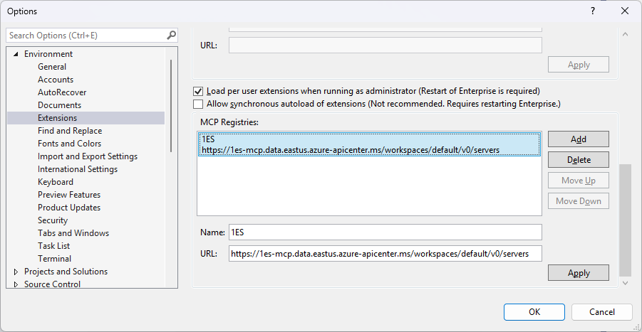
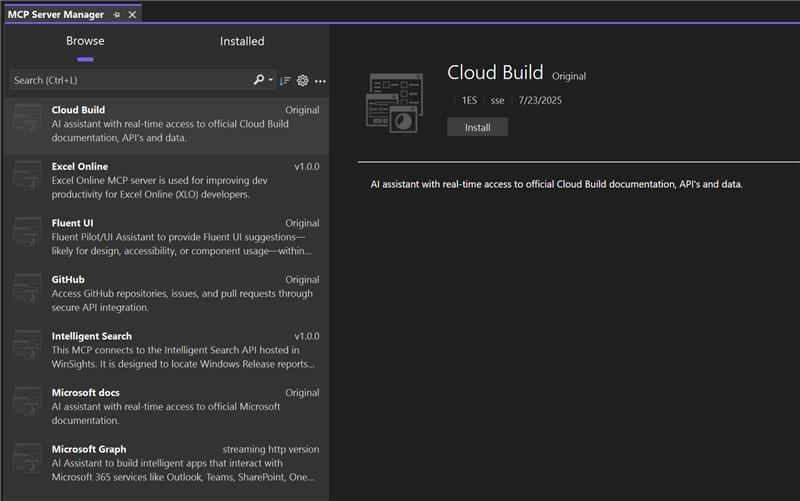

# Using MCP servers at Microsoft

This page tracks Model Context Protocol (MCP) servers that you can use for internal Microsoft development. These servers follow the [Model Context Protocol](https://modelcontextprotocol.io) to expose tools and data to AI systems like copilots and agents.

**1P MCP servers** are servers developed by a Microsoft developer. **3P MCP servers** are servers originally developed by a non-Microsoft developer. 

> 🔒 The page is internal use only – do not share externally. External guidance can be found on [aka.ms/mcp](http://aka.ms/mcp). Contact <1ESMCP@microsoft.com> with questions.

---

## Get started with MCP servers

The **Model Context Protocol (MCP)** is a standard that allows AI apps to access and interact with context-rich services through a consistent interface.  MCP Clients (e.g. VS Code in agent-mode), talk to MCP Servers via the MCP protocol.  MCP Servers can be implemented as either local servers (installed on the client machine) or remote servers (runtime calls to a remote endpoint). 

MCP servers available for both internal AND external consumption are published [here](https://github.com/microsoft/mcp). MCP Servers for Microsoft internal consumption ONLY are published on this page (aka.ms/1mcp). If you are aware of an MCP Server that is not on the list, submit a new [MCP server request](https://aka.ms/MCPServerRequest).

This page describes how to consume MCP servers. For additional guidance on creating your own MCP server, see [Building secure MCP servers](./building-secure-mcp.md) and [Publishing an MCP server](./publishing-an-mcp-server.md). For third-party MCP servers, see [Sponsoring an MCP server](./sponsoring-an-mcp-server.md).

>[!IMPORTANT]
> All servers will soon be catalogued via the 1ES MCP registry and all servers will be documented via the registry.
> All servers catalogued on aka.ms/1mcp and [aka.ms/mcp](https://aka.ms/mcp) will be included in this registry.
> To include your server in the 1ES MCP registry, [open an issue](https://aka.ms/MCPServerRequest) in our GitHub repository.

## Access the 1ES MCP registry

>[!NOTE]
> Remote MCP servers available for use are catalogued in the [1ES MCP Registry](https://aka.ms/MCPRegistry). MCP clients used inside of Microsoft should only use MCP servers included in this registry.

Interested in helping us dogfood the registry? 

### VS Code
1. With VS Code Insiders v1.103+, add the following line to your `settings.json` file: ` "chat.mcp.gallery.serviceUrl": "https://1es-mcp.data.eastus.azure-apicenter.ms/workspaces/default/",`
1. Refresh your VS Code Insiders instance (Developer: Reload Window command).
1. Navigate to the Extensions tab.
1. Search for `@mcp` in the Extensions search bar.
1. All available MCP servers in the registry will now appear and be available to download. This will automatically update your `mcp.json` file.

### Visual Studio 
1. Download VS 2022, Dev 17 build (https://aka.ms/vs/17/int.d17.14/vs_enterprise.exe)
1. Set `https://1es-mcp.data.eastus.azure-apicenter.ms/workspaces/default/v0/servers` as the MCP registry in Visual Studio settings: 
1. Available MCP servers in the 1ES MCP registry will show up in the Visual Studio MCP server manager:  

For non-GitHub Copilot users, we recommend that you explicitly pull MCP servers from the 1ES MCP registry manually if you are looking to include MCP server access to your MCP client. Please reach out to <1ESMCP@microsoft.com> if you plan on consuming the registry outside of the IDE experience.

### Official servers for internal use

The servers listed here are official Microsoft-developed servers for internal use only, developed by the teams responsible for their respective domains (e.g. The Kusto MCP Server is owned by the Kusto team). 

| Server Name        | Install link | Description                                | Team / Owner        | Status     | Last updated |
|--------------------|--------------|--------------------------------------------|---------------------|------------|--------------|
| 1ES PT AI Assistant | [1ES PT AI Assistant](https://dev.azure.com/mseng/Domino/_git/1ESPipelines.Toolset?path=/private/tools/1ESPTAI/MCPServer) | An assistant to help apply change management and optimizations to 1ES Pipeline Templates. | 1ES Pipeline Templates - Dany Khalife <dakhalif@microsoft.com> | In Development | 6/24/25 |
| 1JS Server | [`1js-mcp-server` (view)](https://dev.azure.com/office/Office/_git/1JS?path=/midgard/packages/1js-mcp-server) | A Model Context Protocol (MCP) Server for 1JS. | 1JS Team - Lucy Kimotho <lucy.kimotho@microsoft.com> | In Development | 7/10/25 |
| AEther | [aether-mcp](https://msasg.visualstudio.com/Bing_Ads/_git/AdsMCP?path=/private/src/aethermcpserver/README.md&_a=preview) | A Model Context Protocol (MCP) server providing comprehensive tools for working with AEther experiments and modules. This server enables AI assistants to interact with AEther platform by providing a standardized interface for job management, experiment analysis, and module discovery. | MAI, <ruowu@microsoft.com>, <jianjzh@microsoft.com> | Generally available | 7/31/25 |
| AICoder | [AICoder](http://aka.ms/aicoder) | MCP Server enables AICoder scenarios and plugins to be integrated as tools for other agents to use. | ES365 AI <es365aiteam@microsoft.com> | In Development | 6/2/25 |
| Ask ES Chat | [`https://eschat-agent.azurewebsites.net/mcp`](https://eng.ms/docs/cloud-ai-platform/devdiv/one-engineering-system-1es/1es-docs/es-chat/askeschat-mcp) | Ask ES Chat MCP Server is available. You can ask any engineering system question, and ES Chat provides an answer. Please contact us in Teams Channel prior to reaching out to us directly: https://aka.ms/eschat-teams-chan | ES Chat Team - prvemur <prvemur@microsoft.com>, stephpr <stephpr@microsoft.com> | General Availability | 8/21/25 |
| Bing PerfPipeline MCP Server | [bingpplmcp.azurewebsites.net](https://bingpplmcp.azurewebsites.net) | Provides Bing performance data so team members can analyze and debug performance regressions; access limited to Idweb group "Bing Perf Prod Investigation". | ligua <ligua@microsoft.com> | Private preview | 8/21/25 |
| CloudBuild | [`cloudbuild-mcp-server` (view)](https://mseng.visualstudio.com/Domino/_git/CloudBuild?path=/private/Mcp&anchor=vs-code-integration) | The CloudBuild MCP Server is a specialized integration server for the CloudBuild environment, built using the Model Context Protocol (MCP). It acts as a CloudBuild expert, providing tools to search the codebase, analyze incidents, perform stack trace lookups, diagnose build failures, and query configurations and pipelines—all within the CloudBuild context and tailored to its workflows. This enables efficient troubleshooting and analytics for CloudBuild users, specially when debugging CloudBuild build failures. | CloudBuild - Arthur Freitas Ramoas <arfreita@microsoft.com> | Private Preview | 7/10/25 |
| CodeTesting | [dotnet-codetesting](https://devdiv.pkgs.visualstudio.com/DevDiv/_packaging/AITestingAgent/nuget/v3/index.json) | Tools for intelligent generation of tests and increasing code coverage for various scopes (file, folder, project, solution). - https://aka.ms/codetesting/getting-started | jankrivanek | Private preview | 9/22/25 |
| Coding Flow | [coding-flow](https://github.com/ai-microsoft/coding-flow) | The Coding Flow repository enhances Roo Code capabilities through a suite of integrated tools. Its primary goal is to streamline common tasks in Microsoft Engineers’ daily development workflows by seamlessly connecting them to first-party engineering systems (such as Azure DevOps, Git, and GitHub), orchestrating processes efficiently, and ultimately enabling the generation of AI-powered pull requests. | MAI-A (STCA) AI Productivity V-Team, <penwa@microsoft.com>, <xinli7@microsoft.com>, <ygao@microsoft.com> | Generally available | 7/31/25 |
| Cosmos Powershell | `cosmos-powershell-mcp-server` | A Model Context Protocol (MCP) server that provides tools for interacting with Cosmos databases and analyzing Azure Data Lake Analytics jobs through PowerShell scripts. This is a general-purpose system designed to analyze streams and data processing pipelines. | Pratim Ghosh <pratimgh@microsoft.com> | In Development | 8/21/25 |
| Debug Analysis | Coming soon | Developed by Windows Reliability, leveraging the Debug Analysis API (!analyze) with scoped outputs; supports crash and hang analysis across Windows and other platforms. | arichard <arichard@microsoft.com> | Under development | 8/21/25 |
| dotnet-agent | [dotnet-agent](https://github.com/dotnet-microsoft/ai-tools) | Experimental local MCP server for .NET developers, providing IDE-like tools and LLM-powered code refactoring. | dotnetaitoolsteam@service.microsoft.com | Private preview | 9/22/25 |
| ES Chat Integration | [ES Chat integration](https://eng.ms/docs/cloud-ai-platform/devdiv/one-engineering-system-1es/1es-docs/es-chat/add-mcp-servers) | Connect ES Chat to any internal tools or services via your own Model Context Protocol (MCP) server. Please contact us in Teams Channel prior to reaching out to us directly. | ES Chat, [eschat-teams-channel](https://aka.ms/eschat-teams-chan), <prvemur@microsoft.com>, <stephpr@microsoft.com>  | Generally available | 7/31/25 |
| ES365 | Coming soon | This MCP server will help engineers leverage GitHub Copilot to perform ES365 engineering systems related tasks. | <es365mcpfc@microsoft.com> | In Development | 6/4/25 |
| ES365 | Coming soon | This MCP server will help engineers leverage GitHub Copilot to perform ES365 engineering systems related tasks. | <es365mcpfc@microsoft.com> | In Development | 6/4/25 |
| Excel Online | [excel-online-mcp-server](https://office.visualstudio.com/Office/_git/1JS?path=/ooui/packages/excel-online-mcp-server) | Excel Online MCP server is used for improving dev productivity for Excel Online (XLO) developers. This acts as a central knowledge bank for xlo developers providing prompts, tools to assist in regression retection and analysis, coding guidelines and improving code quality, helping in authoring playwright test using natural language, bug Fixes for Excel Online.  Will be extended for other scenarios as well focusing on xlo developers | XL Online, Shashank Kapoor <kapoors@microsoft.com> | In Development | 8/7/25 |
| Fluent UI | [`fluent-pilot-mcp` (view)](https://github.com/office-shared/fluent-pilot-mcp) | Fluent Pilot is a graph knowledge base augmented LLM chatbot that has comprehensive context about all Fluent libraries and the design system | E+D - Tudor Popa <popatudor@microsoft.com>| In Review | 5/9/25 |
| Intelligent Search | [intelligent-search](https://ismcpdev-apim-ismcp.azure-api.net/ismcp) | This MCP connects to the Intelligent Search API hosted in WinSights. It is designed to locate Windows Release reports and data efficiently. Intended strictly for internal use, access is restricted to Microsoft FTEs to ensure secure and compliant data handling. | RAM Data and AI <smithcharles@microsoft.com>, <ericyu@microsoft.com>, <dianazhang@microsoft.com>, <danizh@microsoft.com> | Private preview | 8/7/25 |
| Kusto | [`kusto-mcp` (view)](https://aka.ms/kusto.mcp) | A Model Context Protocol (MCP) server implementation for Kusto aka. Eventhouse in Microsoft Fabric and Azure Data Explorer. This server enables AI agents to interact with Kusto databases by providing tools and resources through the MCP interface, allowing for seamless data querying and analysis capabilities. |  Kusto team - Anshul Sharma <sharma.anshul@microsoft.com> | Private Preview | 5/9/25 |
| M365 | [`m365-mcp-server` (view)](https://github.com/microsoft/m365-mcp-server) | The M365 MCP Server is a Microsoft 365 Office integration server built using the Model Context Protocol (MCP). It provides tools to interact with Microsoft Graph API, enabling functionalities such as creating Office apps directly in OneDrive. This project is currently a prototype and not generally available (GA). | M365 - Abhijeet Ahuja <abahuja@microsoft.com> | In Development | 5/9/25 |
| Microsoft Docs | [`Microsoft-docs-mcp` (view)](https://eng.ms/docs/cloud-ai-platform/azure-core/azure-experiences-and-ecosystems/ecosystems-engineering/learn-discovery/learn-knowledge-service-partner-integration-docs/remote-mcp-server) | The Microsoft Docs Remote MCP Server is a cloud-hosted service that enables MCP hosts to search and retrieve accurate information directly from Microsoft's official documentation.  | Microsoft Learn - <LearnKS@microsoft.com> | In Development | 5/9/25 |
| Microsoft Graph | [NL2MSGraph MCP Server](https://microsoft.sharepoint-df.com/:w:/t/IdentityCopilotCoalition/Ed5lmkEuZbpCkUP25Rt3isoBBlYXykrPai57LHjSJaYhQg?e=XARBL2) | MCP server for Microsoft Graph, Read-Only, Remote, using HTTP and OAuth | IDM services <entracopilot@microsoft.com> | Early Access | 7/17/25 |
| Microsoft Teams | [`mcp-server-teams` (view)](https://github.com/microsoft/mcp-server-teams) | MCP server for Microsoft Teams. | Microsoft Teams - <rogerche@microsoft.com>, <gunshah@microsoft.com> | Private Preview | 5/23/25 |
| Network Troubleshooter | microsoft-network-troubleshooter-mcp | MCP Server for network troubleshooting on Windows desktop device. | Service Tree <nettrouble@microsoft.com> | In Development | 7/23/25 |
| NuGet | [`NuGet.Mcp.Server` (view)](https://www.nuget.org/packages/NuGet.Mcp.Server) | `dotnet tool install --global NuGet.Mcp.Server --version 0.1.2-preview` to install. This is a Model Context Protocol (MCP) server for NuGet, enabling advanced tooling and automation scenarios for NuGet package management. | Sean Iyer <seiyer@microsoft.com>, NuGet team (ServiceTree ID: `0eaea886-0e70-402f-92aa-ed69849c2707`) | Public preview | 8/21/25 |
| Prime | [`primemcpserver` (view)](https://microsoft.visualstudio.com/CIServices/_git/BOT.McpServers) | `dnx PrimeMcpServer --yes --add-source "https://microsoft.pkgs.visualstudio.com/_packaging/BOTMcpServers/nuget/v3/index.json"` to install. MCP server for interacting with Prime (Windows CI system). It provides tools to monitor and troubleshoot builds, get detailed logs, query the status of a branch, queue new builds and query known issues affecting Prime builds.| Israel Leal <isleal@microsoft.com> | Private preview | 8/21/25 |
| Rush MCP | [@rushstack/mcp-server](https://www.npmjs.com/package/@rushstack/mcp-server) | MCP server for Rush, providing tools for working with a Rush monorepo. | nicpape <nicpape@microsoft.com> | Generally available | 8/21/25 |
| S360 + Breeze | [`s360-breeze-mcp` (view)](https://msazure.visualstudio.com/Service360/_git/Breeze) | **Closed Pilot: Broader Access Coming Soon!** MCP server to query S360 and Breeze data and directly interact with S360 APIs for things like setting ETAs. This will help developers fix S360 issues right in their IDE.| S360 / Breeze <breezecore@microsoft.com>, <s360core@microsoft.com>, <robertherber@microsoft.com> | In Development | 7/10/25 |
| Scope | [`scope-mcp-server` (view)](https://github.com/gim-home/scopemcpserver) | Empower Applied Scientists with a one-stop, automated Scope scripting and workflow solution—purpose-built for Cosmos data processing. | MAI - Dongzhe Jiang <dongzhejiang@microsoft.com> | GA | 7/7/2025 |
| Search and Web Tools | [search-and-web-tools](https://github.com/ai-microsoft/ai-coder-tools) | The Search and Web Tools suite offers a collection of MCP Servers widely utilized by engineers developing products that interact with search and web technologies—including Bing Search, Eureka (Bing AI Search), Edge Puppeteer, Outlook, and Figma, etc.. These tools enhance productivity across everyday development, testing, and prototyping workflows, ultimately supporting the creation of high-quality AI-generated pull requests. It also serves as an open platform, encouraging internal contributors to build and share MCPs that align with related search and web domains. | MAI-A (STCA) AI Productivity V-Team, <penwa@microsoft.com>, <xinli7@microsoft.com>, <ygao@microsoft.com> | Generally available | 7/31/25 |
| Service Tree | [`service-tree-mcp` (view)](https://msazure.visualstudio.com/ServiceTree/_git/ServiceTree-AI-Infra) | MCP server for service tree. It provides tools to interact with Service Tree.  This product is in development.| Service Tree <servicetreefc@microsoft.com>, <umadev@microsoft.com> | In Development | 7/23/25 |
| SmartRepo CodeAnalyzer | [`smartrepo` (view)](https://msasg.visualstudio.com/DefaultCollection/Shared%20Data/_git/Shared%20Data.wiki?version=GBwikiMaster&path=/AdsAI/SmartRepo/Local-Program-Setup.md&_a=preview) | Generate comprehensive code change soution for msasg/SharedData/Ads.BI.SubjectAreas/masterDefault DevOps repository based on user feature asks. User could follow instructions to continue code changing. | AdsBICTS team, Tian Yu <tianyu@microsoft.com> | Private development | 7/31/2025 |
| SubstrateMCP | [Microsoft.Substrate.SubstrateMCP (NuGet tool)](https://dev.azure.com/O365Exchange/O365%20Core/_git/DevProdTools?path=/sources/SubstrateMCP&version=GBmaster&_a=contents) | An MCP server providing AI agents with tools and prompts for TDS operations, TDF account management, token provision, and SubstrateDocs search. | t-adeleel <t-adeleel@microsoft.com> | Private preview | 8/21/25 |
| TestCopilot | [`test-copilot-mcp-server` (view)](https://github.com/stc-asia/test-copilot-core/tree/release/test-copilot-mcp/1.0.1/msnews-ut-copilot/test-copilot-mcp-server) | MCP server for [Test Copilot extension](https://github.com/stc-asia/test-copilot-core/wiki/Test-copilot), which helps generate unit tests for JS/TS with Jest using Copilot. | MAI / ContentService / Weather - <danipi@microsoft.com>, <zuxuanliang@microsoft.com>, <jixiongge@microsoft.com> | Private Preview | 6/4/25 |

### Community servers

The MCP servers listed here are also Microsoft (1P) developed but they are developed for contexts that the maintaining team **does not own**. Use the below servers with caution.

| Server Name        | Install link | Description                                | Team / Owner        | Status     | Last updated |
|--------------------|--------------|--------------------------------------------|---------------------|------------|--------------|
| NuGet Documentation MCP Server | [`McpNetLib` (view)](https://msazure.visualstudio.com/One/_git/McpNetLib?version=GBinit) | An MCP server that provides XML documentation for types from NuGet packages to help AI coding agents understand how to use external library types. [Demo available.](https://microsofteur-my.sharepoint.com/:v:/g/personal/mashabta_microsoft_com/EemrgboDNkdPn8k65oqN-f8BYcwIBvWK7gSg7EiNlDAbFw?e=cnzL0L) | <Matan.Shabtay@microsoft.com> | In review | 5/14/25 |
| Geneva MCP server | [`shopping-assistant-mcp-server` (view)](https://github.com/ai-microsoft/shopping-assistant-mcp-server/tree/main/dotnet-mcp-server) | MCP server for Geneva, the platform that we create and see our monitors from inside Microsoft | <ahmedosman@microsoft.com> | In review | 6/2/25 |

### Denied servers

The MCP servers below are 1P developed, but the servers recreate functionality that already exists in official MCP servers listed above. Use the official 1P servers instead.

| Server Name        | Description                                | Notes | Last updated |
|--------------------|--------------------------------------------|-------|--------------|
| Kusto MCP server | [`johnib/kusto-mcp` (view)](https://github.com/johnib/kusto-mcp/tree/master) | Developers should use 1P MCP servers for Microsoft contexts when possible - especially when the MCP server is maintained by the same product team that owns the context. Use [`kusto-mcp` (view)](https://aka.ms/kusto.mcp) instead. | 5/12/25 |
| ai-coder-tools | [`ai-microsoft/ai-coder-tools` (view)](https://github.com/ai-microsoft/ai-coder-tools/tree/main) | This server has redundancy with MCP servers owned and maintained by the product teams (ex. [ADO](https://github.com/azure-devops-microsoft/AzureDevOps.MCP), [GitHub](https://github.com/github/github-mcp-server), [Kusto](https://aka.ms/kusto.mcp)). | 5/21/25 |
| MCP Server Collection - MCP Server Collection | [`adityavaish/mcp-apps` (view)](https://github.com/adityavaish/mcp-apps) | This server has redundancy with MCP servers owned and maintained by the product teams ([ADO](https://github.com/azure-devops-microsoft/AzureDevOps.MCP) and [Kusto](https://aka.ms/kusto.mcp)). | 5/21/25 |

---

## 3P MCP Servers 

A 3P MCP server is a MCP server that is not created by a Microsoft developer. The intent of this section is to provide visibility into 3P MCP servers usage at Microsoft and best practices for consuming and sponsoring these 3P MCP servers.

If you want to request a new 3P MCP server for use, see [Sponsoring 3P MCP Server](sponsoring-an-mcp-server.md) and open an [issue](https://github.com/1es/ai-for-developers/issues/new?template=3PServerRequest.md) in our GitHub repository.

### 🛠️ Sponsored servers

| Server Name        | Install Link | Description                                | Sponsor Team        | Installation Type | Last updated |
|--------------------|--------------|--------------------------------------------|---------------------|-------------------|--------------|
| Context7 | Needs to be rebuilt | [Approved with Conditions](/aitools/mcp-context7.md), see open source on [GitHub](https://github.com/upstash/context7)  | MCAPS / Juan Burckhardt, WSD-CIA / Sheldon Chen | Local server | 7/11/25 |
| DeepWiki | [DeepWiki MCP](https://mcp.deepwiki.com/) | Sources documentation and deep reasoning from GitHub repos, better onboarding of repos than context7. | Xbox Gaming AI / dicolomb <dicolomb@microsoft.com> | Remote server | 9/21/25 |
| Figma | [`Figma-Context-MCP` (view)](https://dev.azure.com/msazure/One/_git/Figma-Context-MCP) | Figma MCP Server | Azure Edge/Ohad Jassin/Ori Ziv | Local Server, npm package | 5/9/25 |
| Grafana | [`MCPServers.External.GrafanaMCPServer` (view)](https://dev.azure.com/microsoft/STaR/_git/MCPServers.External.GrafanaMCPServer) | [Approved with Conditions](/aitools/mcp-grafana.md) | GPSO STaR Engineering/Ntori Nyamekye/Matt Stead | Local Server, Go binary | 7/11/25 |
| Pandoc | Needs to be rebuilt | [Approved with Conditions](/aitools/mcp-pandoc.md), see open source on [GitHub](https://github.com/vivekVells/mcp-pandoc)  | Azure Throttling Solutions / Shannon Deminick | Local server | 7/11/25 |
| WinDBG Crash Analysis | Needs to be rebuilt | [Approved with Conditions](/aitools/mcp-windbg.md), see open source on [GitHub](https://github.com/svnscha/mcp-windbg) | Observability / Nikhil Manchanda | Local server | 7/11/25 |

### 🔎 In-review servers

| Server Name        | Source code                                | Sponsor Team        | Status     | Teams Requesting | Server type | Requested environment of use | Notes | Last updated |
|--------------------|--------------------------------------------|---------------------|------------|------------------|-------------|------------------------------|-------|---------------|
| Wallaby | More [here](https://wallabyjs.com/docs/features/mcp/) | | Reviewing | E+D / Vritant Bhardwa | Local server | Dev environment | | 5/9/25 |
| Nx Console | More [here](https://github.com/nrwl/nx-console/tree/master) | | Reviewing | Observability / Aaron O'Callagahan | Local server | Dev environment | | 5/12/25 |
| XCodeBuildMCP | More [here](https://github.com/cameroncooke/XcodeBuildMCP) | Engage team | Reviewing | Engage / Joel Klabo | Local server | Dev environment | | 5/12/25 |
| Mobile Next MCP | More [here](https://github.com/mobile-next/mobile-mcp) | | Reviewing | Teams Mobile / Jeremy Keith | Local server | Dev environment | | 5/23/25 |
| MCP-Memory | [server-memory](https://github.com/modelcontextprotocol/servers/tree/main/src/memory) | vrbhardw <vrbhardw@microsoft.com> | Reviewing |  | Local server | Dev environment | npx -y @modelcontextprotocol/server-memory | 8/20/25 |
| Sequential Thinking | [server-sequentialthinking](https://github.com/modelcontextprotocol/servers/tree/main/src/sequentialthinking) | vrbhardw <vrbhardw@microsoft.com> | Reviewing |  | Local server | Dev environment | npx -y @modelcontextprotocol/server-sequential-thinking | 8/20/25 |
| SonarQube | [sonarqube-mcp-server](https://github.com/SonarSource/sonarqube-mcp-server) | dicolomb <dicolomb@microsoft.com> | Reviewing |  | Local server | Dev/Prod | Docker image mcp/sonarqube | 8/21/25 |
| Serena | [serena](https://github.com/oraios/serena) | oraios | Reviewing |  | Local server | Dev environment |  | 9/22/25 |
| ESLint MCP | [@eslint/mcp](https://www.npmjs.com/package/@eslint/mcp) | ESLint | Reviewing |  | Local server | Dev environment |  | 9/22/25 |
| Filesystem | [server-filesystem](https://github.com/modelcontextprotocol/servers/tree/main/src/filesystem) | modelcontextprotocol | Reviewing |  | Local server | Dev environment | npx -y @modelcontextprotocol/server-filesystem | 9/22/25 |

### ❌ Denied servers
  
| Server Name        | Description                                | Notes | Last updated |
|--------------------|--------------------------------------------|-------|--------------|
| Azure DevOps MCP Server | [`Tiberriver256/mcp-server-azure-devops` (view)](https://github.com/Tiberriver256/mcp-server-azure-devops) | Developers should use 1P MCP servers for Microsoft contexts when possible. Use the official [Azure DevOps MCP server (view)](https://github.com/microsoft/azure-devops-mcp) instead. | 5/9/25 |

----
